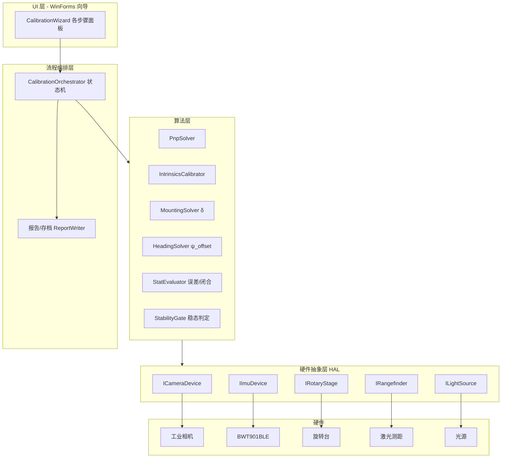
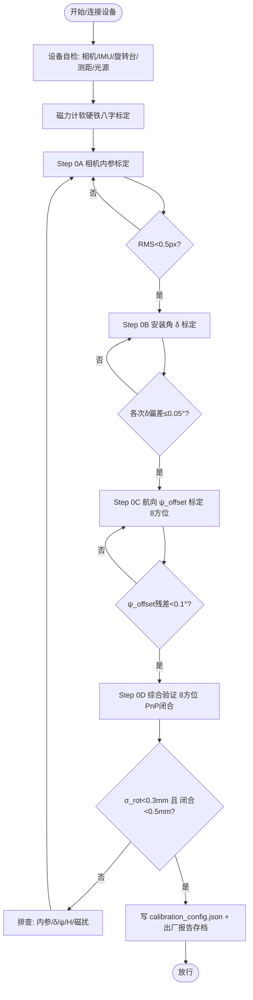
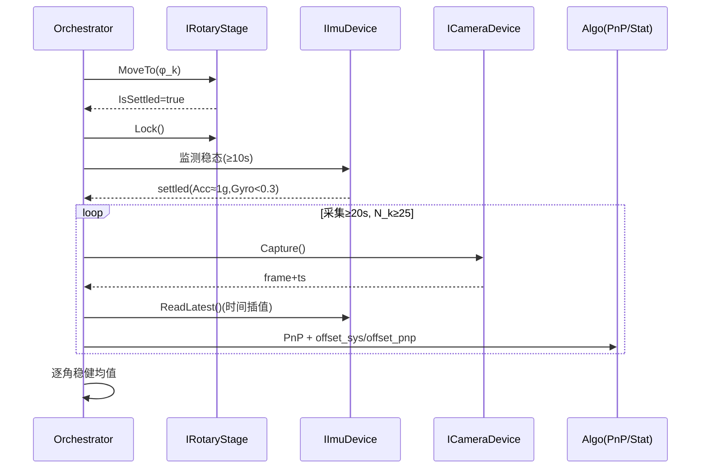

# 数字对中仪出厂校准台 — 研制详细方案设计文档 V1.0

> 编制视角：测量/计量工程。用途：指导校准台（机械结构 + 硬件电气 + 软件）从设计到实现的完整开发。
> 关联文档：[校准方案（靶标板自定位）.md](校准方案（靶标板自定位）.md)、[校准台设计指南与步骤.md](校准台设计指南与步骤.md)、[校准与测量流程.md](校准与测量流程.md)、[标定设计文档.md](标定设计文档.md)

---

## 0. 文档信息

| 项 | 内容 |
|----|------|
| 版本 | V1.0（研制方案） |
| 校准对象 | 数字对中仪（下视工业相机 + BWT901BLE IMU，刚性固连） |
| 核心指标 | H=0.3–0.5 m、offset ≤30 mm、最终水平测量误差 **≤1 mm** |
| 技术路线 | 地面 ChArUco 靶标板 + 相机 PnP 自定位；8 方位 step-and-stare 悬停采集 |
| 软件平台 | .NET Framework 4.6.1 / C# / WinForms；图像 OpenCvSharp；IMU Wit.SDK |
| 交付 | 校准台样机 + 校准软件 `CalibrationBench` + 出厂放行报告体系 |

**术语**：PnP=Perspective-n-Point；ChArUco=棋盘格+ArUco 复合标定板；star=step-and-stare 步进悬停；A/B 类误差见 §5。

---

## 1. 概述

### 1.1 目的与适用范围

建立一台可在出厂前对每台数字对中仪**一次装夹**完成全部标定与放行验证的物理校准台，保证「出厂一次标定 + 现场自由旋转」在规定工况下最终误差 ≤1 mm，并可溯源、可批量、可复检。

### 1.2 校准与验收总指标

| 指标 | 数值 | 说明 |
|------|------|------|
| 工作高度 H | 0.3–0.5 m | 相机镜头至靶标板面 |
| 现场对中残差 offset | ≤30 mm | 星下点→靶标原点水平距离 |
| 最终测量误差目标 | ≤1 mm（合成 ≈0.72 mm 1σ） | 见 §5 误差预算 |
| 相机内参重投影 RMS | <0.5 px | Step 0A |
| 安装角 δ_pitch/δ_roll 残差 | ≤0.05° | Step 0B |
| 航向 ψ_offset 残差 | <0.1° | Step 0C |
| Step 0D 旋转一致性 σ_rot | <0.3 mm | 放行 |
| Step 0D PnP 闭合偏差 | 各角 <0.5 mm，均值 <0.3 mm | 放行 |

### 1.3 系统总体框图

```
┌──────────────────────── 校准台系统 ────────────────────────┐
│                                                            │
│   [结构层]  主框架 / 悬吊-旋转-悬停机构 / 夹持 / 靶标板平台     │
│              / 调平 / 遮光照明箱 / 隔振·磁洁净基座             │
│                        │  承载 & 基准                        │
│   [硬件层]  工业相机 + 镜头 / BWT901BLE / 旋转驱动+编码(可选)   │
│              / 激光测距 / 面光源 / 工控主机 / 供电·线缆        │
│                        │  数据 & 控制                        │
│   [软件层]  HAL 硬件抽象 → 算法(PnP/内参/航向/统计)            │
│              → 流程状态机(磁标定/0A/0B/0C/0D) → 向导UI → 存档   │
│                                                            │
└────────────────────────────────────────────────────────────┘
             产出：calibration_config.json + 出厂放行报告
```

---

## 2. 结构设计

### 2.1 结构组成总览

```
                    ┌─────────────────────────┐
             ①主框架 │        顶部横梁           │
             (铝型材) │   ┌───────────────┐     │
                     │   │ ②旋转-悬停机构  │     │  普通步进+谐波/蜗轮自锁
                     │   │  (卡盘+抱闸)    │     │  编码器可选
                     │   └───────┬───────┘     │
                     │           │ ③夹持吊具     │  设备竖直/镜头朝下/近铅垂
                     │     ┌─────┴─────┐        │
                     │     │ 被校数字对中仪 │       │
                     │     └─────┬─────┘        │
                     │           ▼ 光轴          │
              ⑦遮光   │   H=0.3–0.5m  ⑥激光测距→  │
              照明箱  │ ═══════════════════════   │ ← ④靶标板平台(可调平/可升降)
                     │  ┌───────────────────┐   │
                     │  │  ChArUco 靶标板 ●O  │   │  ⑤三点调平+电子水平仪
                     │  └───────────────────┘   │
                     └──────────┬──────────────┘
                          ⑧隔振·磁洁净基座（大理石/铝平台+隔振垫）
```

### 2.2 分系统说明

| 编号 | 分系统 | 功能 | 关键设计点 |
|------|--------|------|-----------|
| ① | 主框架/立柱 | 承载与提供刚性基准 | 铝型材/铝板，非铁磁；刚度足够抑制振动 |
| ② | 旋转-悬停机构 | 8 方位步进并静止锁定 | 步进电机 + 蜗轮/谐波自锁 + 抱闸；偏心容忍见 §2.4 |
| ③ | 夹持吊具 | 固定被校设备竖直、镜头朝下 | 快换夹具，重复定位；近铅垂即可 |
| ④ | 靶标板平台 | 承载 ChArUco 板，可升降调 H | 升降丝杠 + 锁紧；平面刚性 |
| ⑤ | 调平机构 | 板面水平 <0.01° | 三点螺旋 + 电子水平仪闭环 |
| ⑥ | 激光测距支座 | 测 H | 固定角度垂直入射板面 |
| ⑦ | 遮光/照明箱 | 均匀无频闪照明、隔杂散光 | 直流面光源 + 哑光内壁 |
| ⑧ | 隔振·磁洁净基座 | 抑振、磁洁净 | 大理石/铝平台 + 隔振垫；远离铁磁 |

### 2.3 结构部件选型与精度要求

| 部件 | 选型建议 | 精度/指标要求 | 依据 |
|------|----------|---------------|------|
| 主框架 | 4040/4080 铝型材 + 铝角件 | 立柱垂直度 <0.1°；整体一阶固有频率高于扰动 | 抑振、非铁磁 |
| 旋转轴系 | 交叉滚子轴承转盘 或 蜗轮减速卡盘 | **径向跳动 ≤2 mm**（放宽）；轴向窜动 <0.5 mm | 偏心容忍（PnP 测真值） |
| 步进电机+驱动 | 57/42 步进 + 细分驱动 | 定位到 8 方位 ±5° 即可；停后自锁 | 方位真值由靶标板给 |
| 编码器（可选） | 增量/绝对编码器 | 若装：绝对 ≤0.1°，重复 ≤0.02° | 仅辅助记录 |
| 抱闸/锁定 | 电磁抱闸或蜗轮自锁 | 悬停 30 s 内角漂 <0.05° | 稳态采集 |
| 靶标板平台升降 | 精密丝杠 + 直线导轨 | H 可调 0.25–0.55 m；锁定后 <0.05 mm 漂移 | 覆盖工作 H |
| 调平台 | 三点螺旋微调 | **板面水平 <0.01°** | 平面/尺度基准 |
| 夹持吊具 | 快换 V 型/三爪夹 | 重复定位 <0.1 mm/<0.05° | 换机一致性 |
| 隔振垫 | 橡胶/空气隔振 | 采集时残余振动满足稳态阈值 | 稳态判定 |

### 2.4 关键结构公差与装配要求

**图：偏心容忍（俯视，为何径向跳动可放宽到 mm 级）**

```
   ┌────────── 相机视场 / 靶标板 ──────────┐
   │        星下点随方位画小圆（半径 e）       │
   │            ╭───╮                      │
   │           │ ⊕ │ 旋转轴中心             │
   │            ╰───╯    ● O 靶标原点        │
   └────────────────────────────────────────┘
   约束: (e + 30mm offset) 对应像仍在视场/板内即可
   PnP 每帧直接解出真实 offset_pnp（含 e 漂移）→ 无需把 e 压到 µm
```

| 装配公差 | 要求 | 检验手段 |
|----------|------|----------|
| 靶标板面水平 | <0.01° | 电子水平仪（0.01° 级） |
| 靶标板平整度 | <0.1 mm | 平尺 + 塞尺/三坐标 |
| 相机光轴 vs 板面 | 近垂直即可（残差由 PnP+IMU 吸收） | 目视 + 首帧 PnP 核验 |
| 旋转轴径向跳动 | ≤2 mm | 千分表打表（低要求） |
| H 设定与测量一致 | \|H_laser − H_pnp\| < δH（≤2.5 mm） | 激光 vs PnP 交叉核验 |
| α_board 方位溯源 | <0.1° | 陀螺经纬仪/GNSS 双天线（外协一次） |

### 2.5 材料与磁洁净要求

- 结构、夹具、紧固件用**非铁磁材料**（铝、黄铜、316 非磁不锈钢、工程塑料）。
- 电机为磁源：**远离 IMU 一定距离**（建议 ≥0.3 m）或加坡莫合金屏蔽；采集瞬间可断电机相电流仅靠自锁保持。
- 校准台整体远离钢结构、配电箱、大电流线缆；工作区磁场均匀。
- 预留设备**多轴八字旋转**空间用于磁力计软硬铁标定。

---

## 3. 硬件设计

### 3.1 硬件组成框图

```
                    ┌──────────── 工控主机(Windows) ────────────┐
                    │  CalibrationBench.exe (.NET 4.6.1)         │
                    └───┬──────┬───────┬────────┬───────┬────────┘
              USB3/GigE │  BLE │ RS485 │  串口   │ 触发   │ 显示
                        │      │       │        │        │
                  ┌─────▼─┐ ┌──▼───┐ ┌─▼────┐ ┌─▼─────┐ ┌▼─────┐
                  │工业相机│ │BWT901│ │旋转台 │ │激光测距│ │面光源 │
                  │+定焦镜 │ │ BLE  │ │驱动器 │ │模块   │ │控制器 │
                  └───────┘ └──────┘ └──────┘ └───────┘ └──────┘
   电源: 24V 工业电源 → 电机/光源;  5V/USB → 相机/测距;  设备内置电池/BLE
```

### 3.2 硬件部件清单与选型精度

| 器件 | 选型建议 | 关键指标要求 | 说明 |
|------|----------|--------------|------|
| 工业相机 | 全局快门 CMOS，≥5 MP（如 2448×2048） | 像素当量 = H/fx ≤0.3 mm/px（H=0.5 m）；全局快门防旋转拖影 | PnP/靶标检测精度基础 |
| 镜头 | 定焦低畸变工业镜头 | 覆盖视场（见 §3.4）；近距对焦 0.3–0.5 m；畸变可标定 | 与相机匹配 |
| IMU | BWT901BLE（维特，九轴 BLE） | 静态 pitch/roll ≤0.05°；磁航向 1–2°（现场再评估）；输出率 ≥50 Hz | 现有 SDK |
| 旋转台+驱动 | 步进 + 细分驱动 + 自锁 | 8 方位 ±5°；悬停角漂 <0.05° | 方位真值由板给 |
| 编码器(可选) | 绝对编码器 | ≤0.1° | 辅助记录 |
| 激光测距 | 工业激光测距模块（串口） | ±1 mm、量程 0.1–1 m | 测 H |
| 面光源 | 直流/高频 LED 面光源 + 漫射 | 无频闪；照度均匀性 >90% | 角点检测质量 |
| 工控主机 | Win10/11，USB3 + BLE + 多串口 | 满足相机带宽；实时性一般 | 运行软件 |
| 供电 | 24V 工业电源 + 滤波 | 电机/光源与信号分离供电 | 抗干扰 |
| 线缆 | 屏蔽双绞 + 拖链 | 信号屏蔽接地；远离电机动力线 | EMC |

### 3.3 电气接口与连接拓扑

| 链路 | 物理接口 | 协议 | 数据/命令 |
|------|----------|------|-----------|
| 相机→主机 | USB3.0 / GigE | 厂商 SDK（U3V/GigE Vision） | 图像帧 + 硬件时间戳 |
| IMU→主机 | BLE 5.0 | Wit BLE（`Bwt901ble`） | 加速度/角速度/角度/磁/四元数 |
| 旋转台→主机 | RS485/USB | Modbus-RTU 或 ASCII 命令 | MoveTo/Lock/GetAngle |
| 激光测距→主机 | RS232/USB | ASCII/HEX 帧 | 触发→距离 |
| 光源→主机 | RS232/GPIO | 开关/亮度 | 亮度设定 |

### 3.4 相机-镜头视场与精度校核

**图：视场覆盖与 offset 裕量（侧视）**

```
        ● C 相机
        │╲
      H │ ╲ 半视场
        │  ╲
   ─────┴───╲──────── 靶标板
   地面视场半宽 W_g = min(cx, W−cx)/fx × H
   约束: 30 mm(offset) < 0.85 × W_g   （出厂用实际内参核验）
   像素当量 q = H / fx  →  检测 0.1 px ⇒ 地面 0.1q mm 随机误差
```

| 量 | 公式 | H=0.3 m 示例(fx=2200) | H=0.5 m 示例 |
|----|------|----------------------|--------------|
| 像素当量 q | H/fx | 0.136 mm/px | 0.227 mm/px |
| 检测噪声(0.1px) | 0.1·q | 0.014 mm | 0.023 mm |
| 视场半宽 W_g | (W/2)/fx·H | ~167 mm | ~278 mm |

> fx 为示例，需按实际相机+镜头实测内参最终核验；确保 `30 mm < 0.85·W_g` 与像素当量满足亚 mm。

### 3.5 传感器误差→系统指标映射

| 传感器项 | 指标 | 传播到系统 | 贡献 |
|----------|------|-----------|------|
| 相机内参 δf/f | <0.5% | ×offset | 0.15 mm |
| 靶标检测噪声 | ≤0.1 px | ×q，÷√N | ≤0.15 mm |
| IMU pitch/roll | ≤0.05°（或旋转平均） | H·tanΔθ | ≤0.44 mm |
| IMU 磁航向 | ≤1°（现场控磁扰） | ×offset | ≤0.52 mm |
| 激光测距 H | ±1 mm（δH/H≤0.5%） | ×offset | ≤0.15 mm |
| α_board | <0.1° | 进 ψ_offset | 计入航向项 |

### 3.6 硬件装配与接线要求

1. 相机与 IMU 刚性固连，标定后不得相对位移；标注刚体基准。
2. 电机动力线与传感器信号线分槽走线，屏蔽层单端接地。
3. 激光测距垂直入射板面，避免斜射误差。
4. 光源经漫射板，箱内壁哑光黑，消除杂散光与高光。
5. 上电顺序：先信号后动力；采集前预热相机/IMU 至温度稳定。

---

## 4. 软件设计

### 4.1 软件架构（分层）



### 4.2 校准总流程图



### 4.3 各流程算法详述

#### 4.3.0 稳态判定（贯穿 0B/0C/0D）

```
输入: 最近窗口 IMU 样本
条件1: |√(AccX²+AccY²+AccZ²) − 1.0| < 0.005 (g)
条件2: |GyroX|,|GyroY|,|GyroZ| < 0.3 (°/s)
连续 ≥ min_stable(=对应 ≥10s 且相机 ≥3 帧) 满足 → settled=true
```

#### 4.3.1 磁力计软硬铁标定

```
1. 提示设备绕三轴缓慢八字旋转 ≥ 一定圈数
2. 采集磁场 (MagX,MagY,MagZ) 点云
3. 椭球拟合求硬铁偏置 b 与软铁矩阵 A：h_cal = A·(h_raw − b)
4. 写入 IMU/配置；重连后校核航向漂移
（当前可调用 Wit SDK 内置磁校准；椭球拟合为增强项）
```

#### 4.3.2 Step 0A 相机内参

```
输入: ≥15 张不同角度/距离棋盘格图（距离覆盖 0.3–0.5 m）
1. 逐张 findChessboardCorners → cornerSubPix 亚像素
2. calibrateCamera(objPts, imgPts, imageSize) → K, D_dist
3. 重投影 RMS < 0.5 px 合格
输出: fx,fy,cx,cy,k1,k2,p1,p2 → calibration_config.json
```

#### 4.3.3 Step 0B 安装角 δ_pitch/δ_roll（靶标板 PnP）

```
前置: 0A 完成; 设备近铅垂悬挂静止稳态
对多帧:
  1. 检测 ChArUco 角点 → solvePnP(obj,img,K,D) → R_CB,t_CB
  2. 相机光轴在靶标系(=世界铅垂系)方向 → pitch_cam,roll_cam
  3. 读同刻 IMU: AngleY(pitch), AngleX(roll)
  4. δ_pitch = pitch_cam − AngleY ;  δ_roll = roll_cam − AngleX
取稳健均值; 各次偏差 ≤0.05° 合格
输出: DeltaPitch, DeltaRoll → 配置
```

#### 4.3.4 Step 0C 航向 ψ_offset（8 方位 step-and-stare）

```
对 φ_k ∈ {0,45,...,315}° (大致):
  step-and-stare: 转到位 → 稳定≥10s → 采集≥20s(N_k≥25)
  每帧:
    solvePnP → 图像中板 X_B 轴方位 θ_img_board
    ψ_cam   = α_board − θ_img_board          // 相机X轴真方位
    ψ_imu   = AngleZ + D                       // IMU真北
    ψ_offset_k = ψ_cam − ψ_imu
对 8 角 ψ_offset_k 做圆均值/最小二乘 → ψ_offset (残差<0.1°)
副产物: 磁航向误差样本 = (AngleZ+D+ψ_offset) vs ψ_cam
输出: PsiOffset, α_board, D → 配置
```

#### 4.3.5 Step 0D 综合验证（PnP 闭合 + 旋转不变性）

```
复用/重采 8 方位悬停数据; 每帧:
  真值:   offset_pnp = (C_B.x, C_B.y),  C_B = −R_CBᵀ·t_CB;  H_pnp=C_B.z
  系统值: offset_sys = 现场简化算法(Step4–6):
            Δx=(u−cx)/fx·H; Δy=(v−cy)/fy·H
            Δx+=H·tan(AngleY+δ_pitch); Δy+=H·tan(AngleX+δ_roll)
            heading=AngleZ+D+ψ_offset
            ΔE= Δx·cos h + Δy·sin h ;  ΔN= −Δx·sin h + Δy·cos h
逐角稳健均值 → 计算:
  σ_rot   = 8 角 offset_sys 的散布(两两/绕均值)
  闭合    = 各角 |offset_sys − offset_pnp|
  磁航向误差曲线 = IMU航向 vs 板真方位
放行: σ_rot<0.3mm 且 各角闭合<0.5mm(均值<0.3mm) 且 计入δψ≤1°预测<1mm
输出: factory_verification 报告 + 全部逐帧记录
```

### 4.4 数据结构与配置契约

```csharp
// 相机内参
public sealed class CameraIntrinsics {
    public double Fx, Fy, Cx, Cy;
    public double K1, K2, P1, P2;
    public int ImageWidth, ImageHeight;
}

// 一次 IMU 样本（映射 Wit WitSensorKey）
public sealed class ImuSample {
    public DateTime Timestamp;
    public double AccX, AccY, AccZ;      // g
    public double GyroX, GyroY, GyroZ;   // °/s
    public double AngleX, AngleY, AngleZ;// ° (roll,pitch,yaw)
    public double MagX, MagY, MagZ;      // uT
    public double Q0, Q1, Q2, Q3;
}

// PnP 结果（每帧）
public sealed class PnpResult {
    public double[] Rvec, Tvec;          // solvePnP 输出
    public double OffsetE, OffsetN;      // offset_pnp 水平分量 (mm)
    public double H_mm;                  // H_pnp
    public double PitchCamDeg, RollCamDeg;
    public double ThetaImgBoardDeg;      // 板 X_B 在相机X轴参考系方位
    public double ReprojRms;
    public bool Ok;
}

// 校准配置（写入 calibration_config.json）
public sealed class CalibrationConfig {
    public string DeviceId;
    public CameraIntrinsics Intrinsics;
    public double DeltaPitch, DeltaRoll; // Step 0B
    public double PsiOffset;             // Step 0C
    public double AlphaBoard;            // 靶标板真方位
    public double MagneticDeclination;   // D
    public string CalibratedAtUtc;
}
```

### 4.5 软硬件接口原型（HAL）

> 目标：驱动可替换、算法与硬件解耦。以下为 C# 接口原型；具体实现按选型器件 SDK 适配。

```csharp
public interface ICameraDevice : IDisposable {
    void Connect(string id);
    bool IsConnected { get; }
    CaptureResult Capture();                 // 单帧: 图像 + 硬件时间戳
    void StartStream(Action<CaptureResult> onFrame);
    void StopStream();
}
public sealed class CaptureResult {
    public DateTime Timestamp; public byte[] ImageData;
    public int Width, Height, Stride; public string PixelFormat;
}

public interface IImuDevice : IDisposable {
    void Open(string macOrPort);
    event Action<ImuSample> OnSample;        // 对接 Bwt901ble.OnRecord
    ImuSample ReadLatest();
    void StartMagCalibration();              // 软硬铁八字
    void StopMagCalibration();
}

public interface IRotaryStage : IDisposable {
    void Connect(string port);
    void MoveTo(double azimuthDeg);          // 步进到方位(大致)
    void Lock(); void Unlock();
    bool IsSettled();                        // 到位并稳定
    double? GetEncoderAngle();               // 可选编码器, 无则 null
}

public interface IRangefinder : IDisposable {
    void Connect(string port);
    double MeasureHmm();                     // 单次测距(mm)
}

public interface ILightSource : IDisposable {
    void Connect(string port);
    void SetBrightness(int percent);
    void On(); void Off();
}

public interface IPnpSolver {
    PnpResult Solve(IReadOnlyList<CharucoCorner> corners,
                    CameraIntrinsics k, double alphaBoardDeg);
}
public sealed class CharucoCorner { public int Id; public double U,V; public double Xb,Yb; }
```

**标定步骤统一接口（与现有向导基类衔接）：**

```csharp
public interface ICalibrationStep {
    string Name { get; }
    StepValidation Validate(CalibrationContext ctx);
    StepResult Execute(CalibrationContext ctx, IProgress<StepProgress> progress);
}
public sealed class CalibrationContext {
    public ICameraDevice Camera; public IImuDevice Imu;
    public IRotaryStage Stage; public IRangefinder Rangefinder;
    public IPnpSolver Pnp; public CalibrationConfig Config;
    public string DeviceDir; // device_info/<id>/
}
public sealed class StepResult { public bool Passed; public string Message; public object Payload; }
```

### 4.6 硬件通信协议原型（示例，按器件手册定稿）

**IMU BWT901BLE（现有 Wit SDK 封装）** — 数据键映射：

| 数据 | WitSensorKey | 单位 |
|------|--------------|------|
| 加速度 | AccX/AccY/AccZ | g |
| 角速度 | AsX/AsY/AsZ | °/s |
| 角度 | AngleX/AngleY/AngleZ | ° |
| 磁场 | HX/HY/HZ | uT |
| 四元数 | Q0..Q3 | - |

```csharp
// 适配层：把 Bwt901ble 事件转 ImuSample
bwt.OnRecord += dev => {
  var s = new ImuSample {
    Timestamp = DateTime.Now,
    AccX = D(dev, WitSensorKey.AccX), /* ... */
    AngleX = D(dev, WitSensorKey.AngleX),
    AngleY = D(dev, WitSensorKey.AngleY),
    AngleZ = D(dev, WitSensorKey.AngleZ),
  };
  OnSample?.Invoke(s);
};
double D(Bwt901ble d, string k) => double.Parse(d.GetDeviceData(k));
```

**旋转台（RS485/ASCII 示例协议）：**

| 命令 | 帧 | 返回 |
|------|----|------|
| 移动到方位 | `MOVE,045.0\r\n` | `OK\r\n` / `ERR,<code>` |
| 锁定 | `LOCK\r\n` | `OK` |
| 查询到位 | `STAT?\r\n` | `SETTLED,1` / `SETTLED,0` |
| 读编码器 | `ANG?\r\n` | `ANG,045.02` |

**激光测距（RS232 示例协议）：**

| 命令 | 帧 | 返回 |
|------|----|------|
| 单次测量 | `0xAA 0x00 0x01` | `0xAA <len> <dist_mm 4B> <cksum>` |

**工业相机**：采用厂商 U3V/GigE Vision SDK，封装为 `ICameraDevice`；要求可取**硬件时间戳**用于与 IMU 时间同步。

### 4.7 采集时序（一次方位）



### 4.8 异常处理与日志

| 异常 | 处理 |
|------|------|
| 设备未连接/掉线 | 阻断流程，提示重连 |
| PnP 失败/角点不足 | 本帧丢弃；连续失败→提示调 H/照明/板尺寸 |
| 稳态超时 | 延长等待/加阻尼；超阈报警 |
| RMS/δ/ψ/σ_rot 超差 | 标红判据，引导重标或排查 |
| 配置写入失败 | 事务化写入，失败回滚并提示 |
| 全过程日志 | 逐帧原始数据 + 判据留痕，存 `factory_verification/` |

---

## 5. 精度与误差预算（汇总）

| 误差项 | 公式 | 要求 | 贡献(1σ) | 可否旋转平均消除 |
|--------|------|------|---------|------------------|
| 航向偏置×offset | \|o\|·sinδψ | δψ_bias≤1.0° | 0.52 mm | ❌ A 类 |
| 尺度×offset | \|o\|·(δH/H⊕δf/f) | ≤0.5% | 0.15 mm | ❌ A 类 |
| 倾斜/安装角 | H·tanΔθ | Δθ≤0.05°或旋转平均 | ≤0.44 mm | ✅ B 类 |
| 随机(检测/IMU) | σ/√N | N≥25 | ≤0.15 mm | 部分(√N) |
| **合成** | RSS | | **≈0.72 mm ＜1 mm** | |

倾斜项 H·tan(Δθ) 参考：H=0.3 m 时 0.05°→0.26 mm；H=0.5 m 时 0.05°→0.44 mm。

---

## 6. 验收与测试方案

### 6.1 出厂放行判据

| # | 项目 | 判据 |
|---|------|------|
| 1 | 内参 | 重投影 RMS <0.5 px |
| 2 | 安装角 | 各次 δ 偏差 ≤0.05° |
| 3 | 航向 | ψ_offset 残差 <0.1° |
| 4 | 旋转一致性 | σ_rot <0.3 mm |
| 5 | PnP 闭合 | 各角 <0.5 mm，均值 <0.3 mm |
| 6 | 预测最终误差 | 计入 δψ≤1° 后 <1 mm |
| 7 | 存档 | 真值/报告/磁航向曲线入库 |

### 6.2 测试用例（节选）

| 用例 | 输入 | 期望 |
|------|------|------|
| 已知偏移闭合 | 设备移到多个已知位置(平移台) | offset_sys 与 offset_pnp 差 <0.5 mm |
| 旋转不变性 | 同一 offset，8 方位 | σ_rot <0.3 mm |
| 视场边界 | offset≈30 mm | 靶标不出视场，PnP 稳定 |
| 磁扰敏感性 | 附近引入弱磁 | 磁航向误差曲线可检出 |
| 重复性 | 同机重复 3 轮标定 | ψ_offset/δ 一致性达标 |

---

## 7. 研制计划与里程碑

| 阶段 | 内容 | 交付 |
|------|------|------|
| M1 结构样机 | 主框架/旋转悬停/调平/靶标平台 | 机械台架 + 装配公差报告 |
| M2 硬件集成 | 相机/IMU/旋转台/测距/光源接入 | 通信联调通过 |
| M3 HAL+算法 | ICameraDevice…/PnP/内参/航向/统计 | 单元测试通过 |
| M4 流程编排+UI | 磁标定/0A/0B/0C/0D 向导 | 端到端跑通 |
| M5 精度验证 | 已知偏移闭合 + 旋转不变性 | 达标报告 ≤1 mm |
| M6 出厂化 | 报告体系/存档/批量 SOP | 放行流程固化 |

---

## 8. 风险与对策

| 风险 | 影响 | 对策 |
|------|------|------|
| 现场磁扰使 δψ>1° | A 类主项超标 | 控磁环境 + Step 0C 模式A校核；offset 限位收紧 |
| 电机磁污染 IMU | 航向标定失真 | 电机远离/屏蔽；采集瞬断相电流靠自锁 |
| 近距景深不足 | 角点离焦、PnP 差 | 固定 H 分档/小光圈；镜头选型验证 |
| 相机-IMU 刚性被破坏 | δ/ψ 失效 | 结构加固 + 复检门；返修后重标 |
| 时间同步误差 | 动态项 | step-and-stare 悬停 + 硬件时间戳 |

---

## 9. 附录

### 9.1 目录与产出（对接 device_info）

```
device_info/<设备号>/
  camera_calibration/{input,output}/
  mounting_calibration/{input,output}/
  heading_calibration/{input,output}/
  factory_verification/output/   # Step 0D 逐帧真值+闭合+磁航向曲线+报告
calibration_config.json          # 汇总标定成果
```

### 9.2 接口原型清单（速查）

- HAL：`ICameraDevice` / `IImuDevice` / `IRotaryStage` / `IRangefinder` / `ILightSource`
- 算法：`IPnpSolver` / `IntrinsicsCalibrator` / `MountingSolver` / `HeadingSolver` / `StatEvaluator` / `StabilityGate`
- 流程：`ICalibrationStep` / `CalibrationContext` / `CalibrationOrchestrator`
- DTO：`CameraIntrinsics` / `ImuSample` / `PnpResult` / `CalibrationConfig`

### 9.3 calibration_config.json 示例

```json
{
  "DeviceId": "AT1",
  "Intrinsics": { "Fx":2200.0,"Fy":2200.0,"Cx":1224.0,"Cy":1024.0,
                  "K1":-0.12,"K2":0.03,"P1":0.0,"P2":0.0,
                  "ImageWidth":2448,"ImageHeight":2048 },
  "DeltaPitch": 0.021, "DeltaRoll": -0.015,
  "PsiOffset": 12.34, "AlphaBoard": 30.00,
  "MagneticDeclination": -6.5,
  "CalibratedAtUtc": "2026-09-30T12:00:00Z"
}
```
